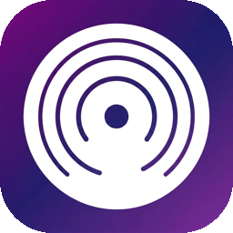

# MySTT — Local Speech-to-Text for macOS

<p align="center">
  
</p>

MySTT is a privacy-focused, offline-first speech-to-text application for macOS. Press a hotkey, speak in **Polish** or **English**, and get corrected, properly formatted text pasted directly into any app.

## Features

- **Fully Offline STT** — Uses [WhisperKit](https://github.com/argmaxinc/WhisperKit) with CoreML for on-device speech recognition. No internet required.
- **Robust Bilingual STT** — Polish and English are decoded explicitly and scored against each other to avoid short-English mistranscriptions.
- **LLM Text Correction** — Optional grammar/punctuation correction via local LLM (LM Studio, Bielik-11B) or cloud APIs (Groq, OpenAI).
- **Transcript-Safe LLM Correction** — The LLM is instructed to normalize dictated text only, never answer it, and unsafe answer-like, translated, or short semantic rewrite outputs are rejected.
- **4-Stage Post-Processing** — Dictionary pre-processing → punctuation correction → guarded LLM normalization → dictionary post-processing.
- **Auto-Paste** — Transcribed text is automatically pasted into the active application.
- **Custom Dictionary** — Add your own terms, abbreviations, and formatting rules.
- **App-Owned Microphone Selection** — MySTT keeps its own preferred mic, favors the built-in MacBook microphone over Continuity/iPhone mics, and binds capture directly to the chosen device.
- **Hotkey Modes** — Tap-to-speak (press once, press again to stop) or hold-to-speak (push-to-talk).
- **Menu Bar App** — Lives in your menu bar, always ready.

## Quick Start (Download)

1. Download `MySTT.dmg` from [`MySTT/build/MySTT.dmg`](MySTT/build/MySTT.dmg)
2. Open the DMG and drag **MySTT.app** to `/Applications`
3. Launch MySTT — it will appear in your menu bar
4. Grant permissions when prompted (Microphone, Accessibility, Automation)
5. Wait for the WhisperKit model to download and compile (~2 min on first launch)
6. Press **Fn** and start speaking

## Requirements

- **macOS 14.0+** (Sonoma or later)
- **Apple Silicon** (M1/M2/M3/M4/M5) — required for WhisperKit CoreML inference
- ~700 MB disk space for the default WhisperKit model (large-v3-turbo)
- Microphone access

## Build from Source

```bash
# Clone the repository
git clone https://github.com/YOUR_USERNAME/MySTT.git
cd MySTT/MySTT

# Build and install (requires Xcode Command Line Tools)
swift build -c release

# Or use the build script (builds, signs, installs to /Applications, creates DMG)
bash Scripts/build_and_install.sh
```

### Build Script

The `Scripts/build_and_install.sh` script:
1. Builds a release binary with `swift build -c release`
2. Creates a proper `.app` bundle with icon and Info.plist
3. Signs with a stable identity (preserves permissions across rebuilds)
4. Installs to `/Applications/MySTT.app`
5. Creates `build/MySTT.dmg` for distribution

> **Note:** For code signing, create a self-signed certificate named "MySTT Developer" in Keychain Access, or modify the `SIGNING_IDENTITY` variable in the script.

## Configuration

### STT (Speech-to-Text)

| Provider | Type | Model | Notes |
|----------|------|-------|-------|
| **WhisperKit** (default) | Local | large-v3-turbo (632MB) | Fully offline, auto-selected by RAM |
| Groq STT | Cloud | whisper-large-v3-turbo | Requires API key |

### LLM Correction (Optional)

| Provider | Type | Model | Notes |
|----------|------|-------|-------|
| **LM Studio** (default) | Local | qwen3-4b-2507 | Runs locally via LM Studio, fully offline |
| MLX via LM Studio | Local | mlx-community/Qwen2.5-7B-Instruct-4bit | Uses LM Studio's OpenAI-compatible API |
| Groq | Cloud | llama-3.1-8b-instant | Requires API key |
| OpenAI | Cloud | gpt-4o-mini | Requires API key |

### Hotkey Options

| Key | Description |
|-----|-------------|
| **Fn / Globe** (default) | Best for most users |
| Right/Left Option | Alternative modifier keys |
| Right Command | Alternative modifier key |
| F5, F6, F9 | Function keys |

## Permissions

MySTT needs these macOS permissions:

| Permission | Why |
|-----------|-----|
| **Microphone** | To capture your speech |
| **Accessibility** | For keyboard simulation (paste fallback) |
| **Automation → System Events** | To paste text into other apps via Cmd+V |

All permissions are requested on first launch. If something stops working after an update, check **System Settings → Privacy & Security**.

## Architecture

```
┌───────────────────────────────────────────────────────────────────────┐
│                               MySTT App                               │
│                                                                       │
│  Fn / Globe                                                           │
│     ↓                                                                 │
│  AppState + HotkeyManager                                             │
│     ↓                                                                 │
│  MicrophoneManager ── prefers built-in mic over Continuity/iPhone     │
│     ↓                                                                 │
│  AudioCaptureEngine ── binds AVAudioEngine to selected AudioDeviceID   │
│     ↓                                                                 │
│  WhisperKitEngine                                                     │
│     ├─ force "pl" decode                                              │
│     ├─ force "en" decode                                              │
│     └─ score/select better candidate                                  │
│     ↓                                                                 │
│  PostProcessor                                                        │
│     ├─ dictionary pre-process                                         │
│     ├─ optional punctuation model                                     │
│     ├─ LLM transcript normalization                                   │
│     │   ├─ quoted transcript prompt                                   │
│     │   ├─ translation / answer / short-rewrite / corruption rejection│
│     │   └─ language guardrails                                        │
│     └─ dictionary post-process / term re-application                  │
│     ↓                                                                 │
│  AutoPaster / Clipboard                                               │
└───────────────────────────────────────────────────────────────────────┘
```

- **Protocol-driven** — `STTEngineProtocol`, `LLMProviderProtocol` make it easy to swap implementations
- **Audio isolation** — MySTT microphone selection is independent from the macOS global input device, does not rewrite system sound settings, and avoids auto-jumping onto newly attached monitor/dock USB microphones
- **Language detection** — Heuristics in `PostProcessor` and scoring in `WhisperKitEngine` help short Polish/English utterances choose the correct decode path
- **Safety guards** — Detects and rejects answer-like LLM behavior, language switching, mistranslations, short semantic rewrites such as Polish `no` → `nie`, and corrupted text before paste
- **Dictionary safety** — Default user rules are migrated forward and dictionary terms are applied before and after the LLM stage

## Security & Privacy

- **API keys are not stored in the repository** — cloud provider keys are stored in the macOS Data Protection Keychain via `KeychainManager`
- **No hardcoded secrets were found in tracked source files** during the publish check for this update
- **Public endpoints in the code are expected configuration** — they are service URLs or localhost defaults, not credentials
- **Local-first by default** — WhisperKit STT works fully offline, and local LM Studio / MLX flows do not require sending dictated text to a cloud service

## Project Structure

```
MySTT/
├── Package.swift              # Dependencies (WhisperKit)
├── Scripts/
│   └── build_and_install.sh   # Build, sign, install, create DMG
└── MySTT/
    ├── App/                   # AppState, AppDelegate, entry point
    ├── Audio/                 # Microphone discovery, prioritization, and device-bound capture
    ├── STT/                   # WhisperKit dual-candidate decode, Groq STT
    ├── LLM/                   # LM Studio, MLX, Groq, OpenAI, Ollama providers
    ├── PostProcessing/        # Dictionary, language heuristics, LLM safety guards
    ├── Paste/                 # Auto-paste via AppleScript
    ├── Hotkey/                # Fn key monitoring (tap/hold modes)
    ├── Models/                # Data models, settings, enums
    ├── UI/                    # SwiftUI settings views
    ├── Utilities/             # Keychain, permissions, sound
    └── Resources/             # Assets, dictionary
```

## Troubleshooting

| Issue | Solution |
|-------|----------|
| "Dziękuję" every time | Your microphone is delivering silence. In MySTT Settings, refresh the microphone list and confirm the active device is a working mic. |
| My iPhone microphone keeps taking over | Current builds prefer the built-in MacBook mic over Continuity/iPhone microphones and no longer auto-switch away from the active mic just because a new USB/monitor device appeared. If needed, reselect the built-in mic in MySTT Settings. |
| Paste not working | Check **System Settings → Privacy → Automation** — enable System Events for MySTT. |
| Model takes long to load | First launch compiles CoreML models (~2 min). Subsequent launches use cached compilation. |
| LLM shows "Not available" | Ensure LM Studio is running with a model loaded, or add a cloud API key in Settings. |
| LLM returns an answer instead of cleaned text | Current builds reject assistant-style responses and fall back to the pre-LLM transcript instead of pasting the answer. |
| Short Polish words get "translated" by the LLM | Current builds preserve very short utterances unless the change is only casing, punctuation, diacritics, or a minor typo fix, so `no` stays `no`. |

## License

MIT

## Acknowledgments

- [WhisperKit](https://github.com/argmaxinc/WhisperKit) by Argmax — On-device speech recognition
- [Bielik](https://huggingface.co/speakleash/Bielik-11B-v3.0-Instruct) by SpeakLeash — Polish language model
